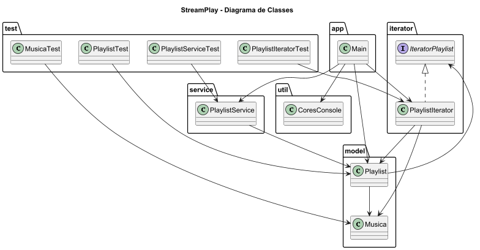

# StreamPlay

Sistema inteligente de playlists musicais desenvolvido em Java utilizando o padrão de projeto Iterator.

O projeto simula uma plataforma moderna de streaming de músicas permitindo percorrer playlists sequencialmente utilizando um iterator personalizado.

---

# Padrão de Projeto Utilizado

## Iterator

O padrão comportamental Iterator foi utilizado para permitir navegação sequencial pelos elementos da playlist sem expor sua estrutura interna.

### Estrutura do padrão no projeto

| Papel | Classe |
|---|---|
| Iterator | IteratorPlaylist |
| ConcreteIterator | PlaylistIterator |
| Aggregate | Playlist |
| ConcreteAggregate | Playlist |

---

# Diagrama de Classes



---

# Funcionalidades

- Cadastro de músicas
- Criação de playlists
- Navegação entre músicas
- Reprodução sequencial
- Iterator personalizado
- Interface via console

---

# Estrutura do Projeto

```text
StreamPlay/
│
├── src/
│   ├── main/
│   │   ├── app/
│   │   │   └── Main.java
│   │   │
│   │   ├── model/
│   │   │   ├── Musica.java
│   │   │   └── Playlist.java
│   │   │
│   │   ├── iterator/
│   │   │   ├── IteratorPlaylist.java
│   │   │   └── PlaylistIterator.java
│   │   │
│   │   ├── service/
│   │   │   └── PlaylistService.java
│   │   │
│   │   └── util/
│   │       └── CoresConsole.java
│   │
│   └── test/
│       ├── PlaylistIteratorTest.java
│       ├── PlaylistServiceTest.java
│       ├── MusicaTest.java
│       └── PlaylistTest.java
│
├── docs/
│   ├── diagrama-classe.puml
│   └── diagrama-classe.png
│
├── README.md
│
└── .gitignore
```

---

# Tecnologias Utilizadas

- Java 17
- IntelliJ IDEA
- JUnit 5
- PlantUML
- Git

---

# Execução do Projeto

## Executando a aplicação

Execute a classe principal:

```text
src/main/app/Main.java
```

Ou execute pelo terminal:

```bash
javac src/main/app/Main.java
java src/main/app/Main
```

---

# Execução dos Testes

Os testes automatizados estão localizados em:

```text
src/test
```

## Executando no IntelliJ

- Clique com o botão direito na pasta `test`
- Selecione:
Run Tests

---

# Casos de Teste Implementados

## MusicaTest

- Criação de músicas
- Verificação de atributos

## PlaylistTest

- Adição de músicas
- Armazenamento na playlist

## PlaylistIteratorTest

- Navegação entre músicas
- Percurso da playlist

## PlaylistServiceTest

- Cadastro de músicas
- Integração da playlist

---

# Exemplo de Funcionamento

```text
Blinding Lights - The Weeknd
Levitating - Dua Lipa
As It Was - Harry Styles
```

---
